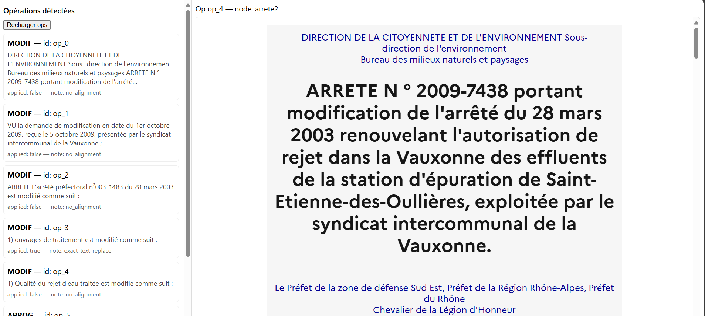

#  Projet de Consolidation d’Arrêtés Administratifs

##  Contexte

Ce projet a pour objectif de **consolider automatiquement des arrêtés administratifs** en appliquant une suite d’**opérations de modification** détectées dans des documents juridiques.  
Il permet :  
- de charger des textes d’arrêtés,  
- de détecter et extraire les modifications (`MODIF`, `VU`, `ARRETE`, etc.),  
- de les appliquer automatiquement au texte de référence,  
- puis de générer une **version consolidée** accessible via une interface web.  

---

##  Fonctionnalités principales

- **Extraction automatique d’opérations juridiques**  
  Les modifications (ajouts, suppressions, remplacements) sont extraites et listées dans une interface.

- **Application des opérations**  
  Chaque opération peut être appliquée ou non. Les résultats sont sauvegardés dans `applied_ops.json`.

- **Consolidation automatique**  
  Génération d’une version consolidée des arrêtés au format `.html`.

- **Interface utilisateur**  
  Affichage :  
  - à gauche, la liste des opérations détectées,  
  - à droite, le rendu du texte consolidé.  

- **Standardisation des fichiers de sortie**  
  Renommage automatique des fichiers pour éviter les suffixes répétitifs comme  
  `arrete2_consolidated_consolidated.html`.

---

## Structure du projet

```bash
out/
 └── consolidated/             # Dossier de sortie des arrêtés consolidés
     ├── applied_ops.json      # Historique des opérations appliquées
     ├── conflicts.json        # Gestion des conflits éventuels
     ├── arrete1_consolidated.html
     ├── arrete2_consolidated.html
     ├── ...
```

##  Installation et Lancement

### 1. Prérequis
- Python 3.10+
- Node.js (si front séparé)
- pipenv/venv recommandé

### 2. Installation des dépendances
```bash
pip install -r requirements.txt
```

### 3. Lancer le backend
```bash
uvicorn main:app --reload
```

### 4. Lancer le front (selon votre stack)

Pour ce projet , j'ai juste exposé le port 8000 dans mon back pour afficher un simple front en html.

##  Exemple d’utilisation

1. Charger un arrêté source (`arrete2.html`).  
2. Les opérations détectées s’affichent dans le panneau gauche.  
3. Appliquer les modifications désirées.  
4. Générer la version consolidée (`arrete2_consolidated.html`).  
5. Visualiser le texte consolidé dans l’interface.  

 [](Visualisation/Capture d'écran 2025-09-27 222959.png) [](Visualisation/Capture d'écran 2025-09-27 223120.png)
